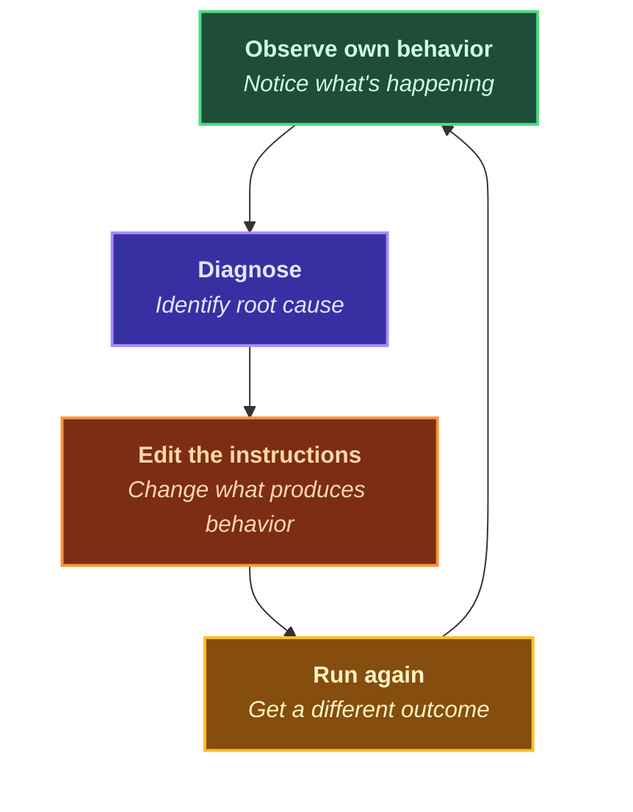
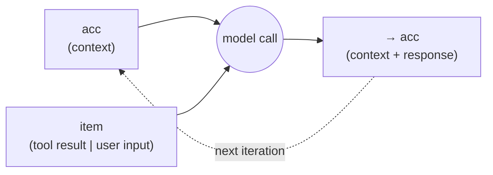
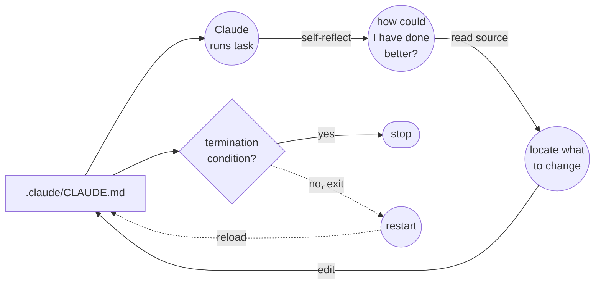
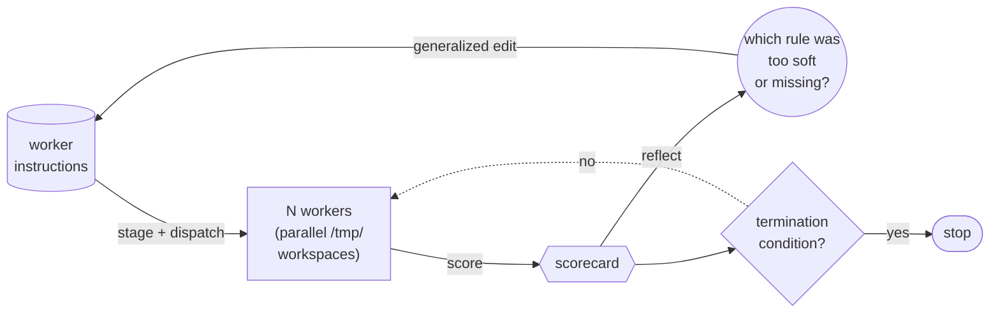
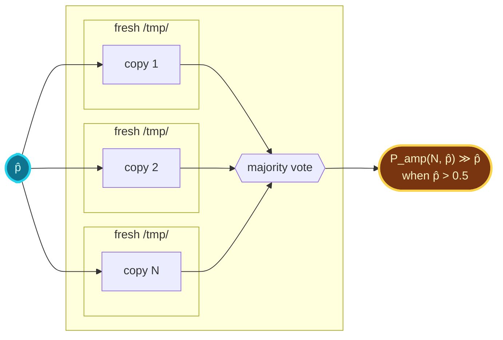
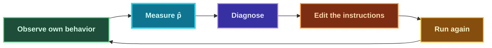

# Agent Tuning

> An attempt to understand `.claude/` directories as a **program** whose expected-outcome probability is computable — and therefore tunable by recursion.

## Prerequisite

This is not a tutorial on Claude Code. It assumes you've used it. If you haven't, [Components of a Coding Agent](https://magazine.sebastianraschka.com/p/components-of-a-coding-agent) is the best deep dive I know of.

## Self-reflection

Claude is more than a leet code generator. Because of its attention mechanism, it can close the loop: observe own behavior -> diagnose -> edit the instructions that produce the behavior -> run again and get a different outcome -> observe own behavior. Claude's attention doesn't distinguish between "instructions I'm writing" and "instructions I'm following" -- they're both just tokens in context.



The examples below are real-world uses of self-reflection to tune agents. They work — often very well — yet they're crude. This document exists because the patterns kept reappearing across them, and they deserved to be surfaced.

- [Claude can reverse engineer any website](https://github.com/adam-s/intercept?tab=readme-ov-file#how-it-works)
- [Claude can create trading strategies that beat SPY buy and hold](https://github.com/adam-s/alphadidactic?tab=readme-ov-file#alphadidactic)

After iterations using self-reflection in many different domains, each project converged on the same handful of structural patterns: deterministic verifiers, bounded sub-agents, generalization guards, disposable workspaces, and others.

The `.claude/` directory is a set of instructions a machine reads and executes, a program(?). In order to explain this to another software engineer, a grounded mental model is needed. Is it reflective programming? Is it recursion? Is it Turing complete? Probably. Nonetheless, a Turing Machine has a deterministic transition function which `.claude/` does not. The question we should be asking is, **"what can be relied upon if it isn't deterministic?"**

## The Resolver

A Python program and a `.claude/` program are the same shape. Both are instructions a machine reads and acts on. Both have a program, an input, a state, a **resolver** that decides "given where I am now, what do I do next," and an output. Four of those five components are analogous between the two. The fifth — the resolver — is the entire difference.

In a Python program, the resolver is the language's transition rules: fixed, deterministic semantics that map the current state and the next instruction to exactly one next state. Same inputs in, same state out, every time, under fixed runtime conditions. It's the same idea as a Turing machine's transition function, just scaled up to a real language. You can print it on paper. You can step through it by hand.

In a `.claude/` program, the resolver is **attention over the context window**. The current state is the entire token stream — your CLAUDE.md, the conversation, the files in scope, the prior tool outputs, all concatenated. To decide what to do next, the model computes, for every token in that stream, a similarity score against the position it's currently trying to extend, and produces a weighted sum of their learned representations. That weighted sum is the lookup. There is no finite table. There is no exact match. The output is a probability distribution over next tokens, and one is sampled from it.

That single swap — finite deterministic table out, attention-weighted soft lookup in — is where every other difference comes from. Reproducibility, testability, what "correct" means, what "reliable" means: none of them survive the swap unchanged. The rest of this project is about what *does* survive, and what new things become available in exchange.

## The Sacrifice

"Correct on every run" belongs to the deterministic resolver and does not survive the swap. Instead, the **fraction** of runs a program produces the right output -- a frequency, not a guarantee -- survives. The question changes from "did it work?" to "how often does it work?" and "how often" is a number. Numbers can be predicted from the program's structure, measured by running it, and compared. A binary property is gone; a quantitative one takes its place.

That is a huge sacrifice! What do we get in return?

["Boyd’s Law of Iteration – speed of iteration beats quality of iteration."](https://blog.codinghorror.com/boyds-law-of-iteration/)

There are several situations in computer science where an algorithm that is close enough is preferred than an algorithm that is always correct.

- **UDP** video calls let packets vanish or arrive corrupted, because waiting for retransmissions would freeze the picture.
- **Stochastic gradient descent** picks a random mini-batch of training data and treats it as the whole dataset, because computing the true gradient on every step would make training infeasible.
- **Speculative execution** in modern CPUs guesses which branch a program will take and rolls back when wrong, because waiting for the real answer would leave half the silicon idle.
  
Branch prediction is different from the first two. UDP video, and stochastic gradient descent all just absorb the wrongness. Code execution can't allow dropped instructions. The imperfection pays off when there's a cheap step at the end that checks whether the fast answer was right, and re-runs when it wasn't.

A Monte Carlo algorithm always finishes on time but might be wrong. A Las Vegas algorithm always gives the right answer but might take unpredictably long. The conversion between them is free: if you have a Monte Carlo algorithm and a cheap verifier, you re-run until verification passes, and you have a Las Vegas. We are going to borrow this concept for the shape of a `.claude/` program.

The borrowed shape leaks in two places. A Monte Carlo algorithm always finishes on time by definition; a `.claude/` program can run out of context, loop, exhaust its tool budget, or simply fail to converge. And "re-run until verification passes" is a textbook loop with no exit. A real `.claude/` program needs a **termination condition** — a retry cap, a token budget, an escalation path when the verifier keeps failing — and designing that condition is one of the actual engineering problems the abstract MC->LV story doesn't cover.

## Tuning `.claude/`

**The goal of this section is to help you get a nondeterministic agent to behave predictably.**

It serves no purpose to compare instructions between natural-language agent instructions and code instruction. "English is fuzzy, Python is precise." Nothing prevents agent instructions from being written in perfect Python!

In an agent like Claude, the "resolver" is the model itself, dispatching over the context window via attention; when CLAUDE.md says "use `foo()`," that's not a function call the runtime is obligated to honor, it's a prompt the model may or may not attend to, surface, and act on, with some probability that depends on everything else competing for attention in context.

### Iteration

Claude Code handles all iteration. A turn is one call to the model: the context goes in, the model writes something back, and that response gets added to the context for the next turn.

Each turn is one step of a fold: the context is the accumulator, the model is the reducer, and each turn's new input (tool result, user message) is the next item. The item stream is filled in as the loop runs — the tool result on turn 5 only exists because the model emitted a tool call on turn 4, and the user's reply on turn 6 only exists because the user has already seen turn 5 — so the runtime is a `while` loop:

```javascript
let context = initialContext;

while (!done(context)) {
  context = [...context, model(context)];      // model emits response
  context = [...context, nextItem(context)];   // tool result or next user message
}
```



### Context drift

> [!CAUTION]
> The fold above has a property that a pure fold does not: the reducer is probabilistic, and the accumulator grows on every turn. The model attends to the whole accumulator on every call, and as it grows any single instruction's relative weight gets pulled down by everything that has happened since — even though older instructions are still literally in the context. This is **context drift**. The same instruction at the top of `CLAUDE.md` lands differently on turn 7 than on turn 2, not because the instruction changed but because the *accumulator* changed.
>
> Nothing fixes this at the runtime level — the runtime is just the fold. Every technique in the rest of this document is an answer to the same question: *how do you keep a probabilistic reducer behaving predictably as its accumulator grows without bound?*

### Recursion

> **Worked example:** [applications/recurse](applications/recurse/) · [README](applications/recurse/README.md)

A recursive agent attempts a task, **self-reflects on how it could have done better**, reads its own source to find what to change, edits its own source, and runs again on the edited version. After enough runs, the source has been shaped into something that does the task on its own.

For Claude Code, the source is `.claude/CLAUDE.md` and anything else under `.claude/`. A recursive run looks like:

1. The agent runs against the current `.claude/CLAUDE.md`.
2. The agent attempts the task.
3. The agent **self-reflects**: *"How could I have done this better? What instructions do I need to change?"*
4. The agent reads its own source to locate where the failing behavior is encoded and where the fix should go.
5. The agent edits `.claude/CLAUDE.md` based on the reflection and the read.
6. The agent checks the **termination condition**: task verified, no edit was needed, or iteration cap reached → stop. Otherwise the agent exits and is restarted from step 1.



The thing that makes this recursion rather than iteration is steps 3–5: the agent is rewriting the rules it will run under next time, not just appending to its working memory. Self-reflection without a read is aimless; a read without reflection is mechanical.

The loop assumes a model capable enough to treat its own instructions as inspectable text and reason about *why* a phrasing produced a particular failure. Frontier models can do this; smaller models can't yet.

The termination condition is what keeps the recursion finite. The three exits are: the task is verified (success), the reflection produced no edit (fixed point), or an iteration cap is reached (safety).

> [!TIP]
> Edits must generalize: a good fix works for any future input, not just the one that failed. If you can name a specific website, library, or error type in the fix, rewrite it as a principle.

<!-- -->

> [!WARNING]
> The agent will satisfy the termination condition. If the condition is vague, the agent will satisfy it by the easiest path available.

**This is how a `.claude/` is trained: by being run, observed, and rewritten until it does the task without being rewritten again.**

The worked example linked at the top of this section uses a sibling file as the source-of-record rather than `.claude/CLAUDE.md` itself, to keep the git history clean.

### Orchestrator

> **Worked example:** [applications/orchestrator](applications/orchestrator/) · [README](applications/orchestrator/README.md)

An orchestrator dispatches work to one or more **workers**, observes how they did, **reflects on what to change**, and edits the workers' instructions for the next round. The orchestrator never attempts the underlying task itself — its job is to *train the workers*, not to do the work. After enough rounds, the workers' instructions have been shaped into something that does the task on its own.

For Claude Code, the workers are subagents (other Claude invocations) with their own scoped `.claude/`-style instructions. A round looks like:

1. The orchestrator stages each worker's environment in a fresh `/tmp/` directory and dispatches N workers in parallel.
2. Each worker attempts the task in its staged workspace.
3. The orchestrator scores each worker's output against a scorecard.
4. The orchestrator **reflects**: *"Which rule was too soft, missing, or wrong? Which fix would generalize across all the failures, not just this one?"*
5. The orchestrator edits the workers' instructions based on the reflection.
6. The orchestrator checks the **termination condition**: all workers passed, the edit rate is near zero, or an iteration cap is reached → stop. Otherwise dispatch the next round.

A worker's `/tmp/` is not a snapshot of the source tree. The orchestrator *composes* it: copy in only the files the worker needs, modify those files before the worker sees them (inject logging, swap implementations, mock dependencies), add files that didn't exist in the source (a script to ship logs to `/tmp/logfile-XXX.log`, a stub server, a fake fixture), and withhold anything the worker shouldn't see (the grader, the ground truth, the inputs). Each worker is a fresh experiment the orchestrator designs from scratch. The throwaway nature of `/tmp/` is what makes this cheap — instrument now, observe, discard the whole tree, repeat.



The thing that distinguishes the orchestrator pattern from the recursion pattern is *who edits whose source*. In recursion, the agent edits its own source and reruns itself. In orchestration, the orchestrator edits the **workers'** source and re-dispatches the workers. **Recursion is training yourself; orchestration is training someone else.** The loop shape is otherwise identical — observe, reflect, edit, retry — but the separation between orchestrator and worker is what makes orchestration scale to dozens of parallel workers and what makes the workers' instructions independently usable at convergence.

Two structural choices shape any orchestrator pattern:

- **Identical-parallel workers vs. role-based sequential workers.** Identical-parallel workers all do the same task against varied inputs (or even the same input). Their disagreements expose nondeterminism and instruction gaps that any single worker would have missed. Role-based workers do *different* jobs in sequence (a builder, a reviewer, an adversary) and their failures expose handoff problems between roles. Both work; they fail differently.
- **Diagnosis-driven vs. metrics-driven feedback.** Diagnosis-driven loops read individual failure traces and apply *targeted* edits — the orchestrator understands *why* a specific worker failed and writes a fix that generalizes. Metrics-driven loops read aggregated statistics (pass rate, token efficiency) and rely on a generative step to produce candidate variants. Diagnosis converges faster on problems where failures can be *understood*; metrics converges on problems where failures can be *measured but not articulated*.

The most important constraint on the edit step is **generalization**. A fix must work for *any* future input, not just the one that failed. A fix that says "always click the pagination control on this specific website" is overfit and the next iteration will break on a different site. Rewritten as "always interact with pagination controls before declaring data collection complete," the same fix generalizes — and is the only kind of fix that survives across iterations. The test is concrete: if you can name a specific website, library, error type, or other domain detail in the fix, it is overfit. Rewrite it as a principle, or revert it. Without a generalization rule on edits, the worker instructions accumulate special cases until they collapse under their own weight.

> [!TIP]
> Edits must generalize: a good fix works for any future input, not just the one that failed. If you can name a specific website, library, or error type in the fix, rewrite it as a principle.

<!-- -->

> [!WARNING]
> The worker will satisfy the scorecard. If the scorecard checks compliance instead of quality, the worker will satisfy compliance and produce poor-quality work that passes anyway.

**This is how a fleet of `.claude/`s is trained: by being dispatched, scored, and rewritten until fresh workers satisfy the scorecard without further edits.**

### Reliability Testing

I worked on testing experiments on AI agent reliability, which are detailed in [Reliably Incorrect: An exploration of AI agent reliability through data visualization](https://adamsohn.com/reliably-incorrect/). These experiments explore how language models fail in structured and predictable ways when performing multi-step reasoning tasks. By analyzing model behavior across varying difficulty levels, the research introduces a formula for reliability ($P(success) = p_{step}^N$), demonstrating how per-step errors compound exponentially. The findings reveal that self-verification often fails to catch errors because it relies on the same error-prone generation process, and that models exhibit distinct behaviors—such as grinding endlessly or quitting quickly—when pushed beyond their capabilities. This quantitative approach to measuring step accuracy provides the reliable evaluation signal needed to tune agents and measure iterations.

### Amplify

> **Worked example:** [applications/amplify](applications/amplify/) · [README](applications/amplify/README.md)

A Turing machine has a fixed transition table — given state X and symbol Y, always do Z. The table is small enough to print on paper, which means you can prove things about it directly: for every input, the machine reaches the right output, and the proof holds on every run, forever. There's no ambiguity in what the machine will do.

Attention-based systems replace that deterministic lookup with learned attention over context. The resolver — the thing that decides what to do next — is now a statistical, context-dependent mechanism rather than a fixed rule table. There is no finite table to inspect, nothing to step through, nothing to prove against. Classical correctness — the for-all-inputs kind — isn't hard here. It's undefined. The word doesn't apply.

You trade provable correctness for expressive flexibility, and something has to take the place of the proof, or there's no way to talk about whether a `.claude/` program is good.

The replacement is a number. Run the program many times on representative inputs, count how often it produces the right answer, and report the success rate with a confidence interval. Instead of "always correct," the claim becomes "correct with frequency `p`, on this task distribution, to this precision." That's weaker than a proof, but it's a real claim: it can be reproduced, compared across versions, and tightened by sampling more.

Once you have the number, you can do something with it. Run `N` independent copies of the program on the same input, in parallel, and take the majority answer. If the single-run rate is above 50%, the majority-vote rate is higher than the single-run rate, and it keeps climbing toward 100% as `N` grows. The relationship has a closed form: the probability of a majority of `N` independent trials succeeding, computable from `p` alone, no further experiments needed. If the single-run rate is *below* 50%, majority voting makes things worse. The number has to come first: you can't safely combine copies of a program whose success rate you haven't measured.



The number is also what closes the iteration loop. Recurse and orchestrator both depend on telling whether one version of a program is better than another — whether an edit moved it forward or backward. The only way to tell is to measure both and compare. Without a number, "better" is a vibe and iteration is a random walk. With a number, every rewrite has a measurable delta, and the loop converges on whatever reliability target you set.



Quantifying `.claude/` instructions is what turns a prompt you write and hope into a program whose expected-outcome probability is computable — and therefore tunable by recursion.

## Conclusion

A `.claude/` directory looks like configuration and behaves like a program. The swap from a deterministic resolver to attention over a context window costs you "correct on every run" and gives you a number in exchange: the fraction of runs that produce the right output. Everything in this document is built on that single trade.

Once correctness is a number, the rest follows mechanically:

- **Recursion** rewrites a program against its own failures.
- **Orchestration** rewrites a fleet of workers against a scorecard.
- **Amplification** combines independent runs of a measured program into a more reliable one — but only after the number exists.
- **Iteration** is the substrate all three run on, and **context drift** is the force they're all pushing against.

None of these techniques require a new runtime, a new model, or a new framework. They require treating `.claude/` as a program, measuring it, and editing it on the basis of what the measurement says.

If there is one rule to take away: **don't iterate on a `.claude/` you haven't measured.** Without `p̂`, "better" is a vibe, recursion is a random walk, and amplification is a coin flip that might be making things worse. With `p̂`, every edit has a sign and a magnitude, and the loop has somewhere to converge.
