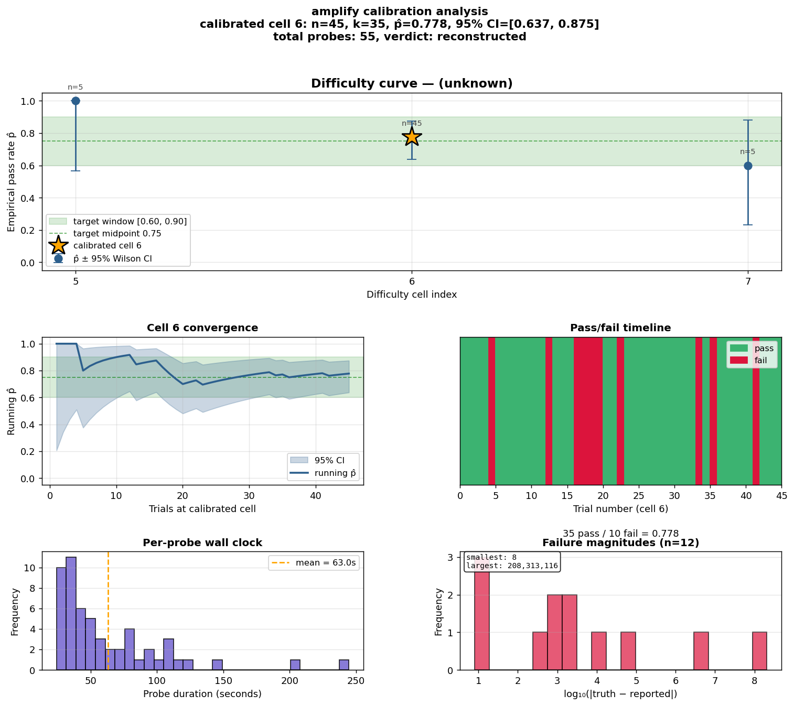
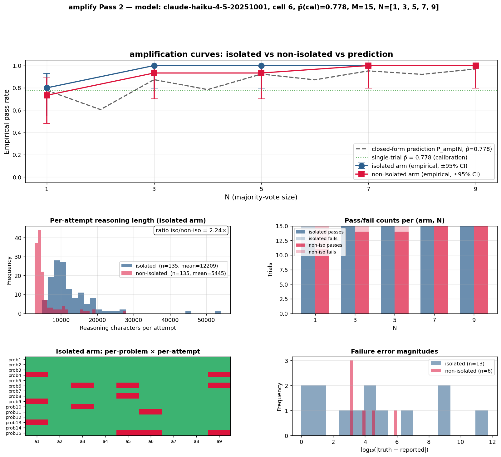

# amplify

> [`recurse`](../recurse/) and [`orchestrator`](../orchestrator/) tune `.claude/` programs by **editing instructions**. `amplify` tunes them by **composing instances** — and the result is predictable in closed form before you run it.

This is the worked example for the half of the project's tagline the other applications can't demonstrate: *expected-outcome probability is computable — and therefore tunable by recursion*. [recurse](../recurse/) and [orchestrator](../orchestrator/) tune `P` qualitatively by rewriting source. `amplify` is the case where `P` is a number you can write down in advance from the program's structure, and where running `N` independent copies in parallel lifts that number to a target reliability via the binomial CDF.

## What survives the swap from Turing machine to `.claude/`

A Turing machine's transition function is a finite table. A `.claude/` program's resolver is attention over an unbounded context, and its output is a probability distribution. Correctness-as-proof does not survive that swap. What survives — and what `amplify` measures — is **success as a frequency**:

1. **The single-attempt success rate `p̂` is a well-defined number.** You measure it the way you'd measure the clock speed of a CPU: run the program many times on representative inputs, count successes, report a confidence interval. Pass 1 of this experiment does exactly that.

2. **The compound success rate of a derived program is computable from `p̂` alone.** Run `N` independent copies in parallel, majority-vote the outputs, and the compound rate follows the binomial CDF:

   ```text
   P_amp(N, p) = Σ_{i ≥ ⌈N/2⌉} C(N, i) · p^i · (1−p)^(N−i)
   ```

   No further experimentation needed. Plug in `p̂ = 0.778` and you get `0.778, 0.874, 0.924, 0.952, 0.970` for `N = 1, 3, 5, 7, 9`, on paper, before spawning a single sub-agent.

3. **`P_amp` takes a success rate and returns a success rate, so it literally recurses.** Feed its output back in as input — nine copies of a nine-copy block — and reliability converges toward 1 at a rate you can compute in advance. That is "tunable by recursion" in the literal mathematical sense: a fixed-point iteration of a real function, instantiated in code by nesting `claude --print` calls.

4. **Independence is an engineered property, not a free one.** The binomial formula assumes `N` independent Bernoulli draws. In a deterministic world that's trivial. In `.claude/` it requires discipline: fresh subprocess, fresh tempdir, fresh context, no shared state. Pass 2 of this experiment measures what happens when that discipline holds (the **isolated arm**) and what happens when it's broken (the **non-isolated arm**).

The upshot is a second tuning knob that `recurse` and `orchestrator` don't offer. Those patterns tune `p` qualitatively by editing instructions. `amplify` tunes compound reliability at fixed `p` quantitatively by choosing `N`. The two knobs compose: get `p` into a useful range via instruction editing, then hit your reliability target via parallelism. The math tells you exactly how much parallelism you need.

## Pass 1 — Calibration

`runner/calibrate.py` finds a task where the model's single-attempt success rate lands somewhere in the `[0.55, 0.85]` window. Plain integer multiplication is too easy for frontier models with scratchpad, so the calibrator probes a staircase of **compound math expressions**:

| index | template | example expression |
| --- | --- | --- |
| 0 | `mul-3x3` | `123 * 456` |
| 1 | `mul-4x4` | `1234 * 5678` |
| 2 | `mul-5x5` | `12345 * 67890` |
| 3 | `mul-5x7` | `12345 * 6789012` |
| 4 | `muldiv-5x7//4` | `floor( (12345 * 6789012) / 1234 )` |
| 5 | `muldiv-6x7//5` | `floor( (123456 * 7890123) / 12345 )` |
| 6 | `muldiv-7x7//5` | `floor( (1234567 * 8901234) / 12345 )` |
| 7 | `muldiv-8x8//6` | `floor( (12345678 * 90123456) / 123456 )` |
| 8 | `twomul-(6x6+6x6)//5` | `floor( (123456 * 234567 + 345678 * 456789) / 12345 )` |
| 9 | `twomul-(7x7+7x7)//5` | similar with 7-digit operands |
| 10 | `chained-((6x6)//5+4)*4` | `( floor( (123456 * 234567) / 12345 ) + 1234 ) * 5678` |
| 11 | `chained-((7x7)//5+4)*4` | similar with 7-digit operands |

Each cell is a generator: every probe at the same cell gets a fresh random instance. The compound structure forces the model to hold intermediate state across many steps, producing the random arithmetic slips the binomial-amplification math needs.

The search is multi-cell adaptive: bracket with binary search, triangulate neighbors, dwell on the centermost in-window cell. A cell is calibrated when its point estimate `p̂ ∈ [0.60, 0.90]` and the 95% Wilson CI width is ≤ 0.25.



**Result for Haiku 4.5.** Cell 6 (`muldiv-7x7//5`): `n=45, k=35, p̂=0.778, 95% CI [0.637, 0.875]`. Each probe runs in its own `tempfile.TemporaryDirectory()` with a freshly written minimal `.claude/` — no shared filesystem state across probes.

```bash
python3 runner/calibrate.py
```

## Pass 2 — Amplification

`runner/amplify.py` takes the calibrated `(model, problem-class, p̂)` tuple and runs it two ways.

**Arm A — Isolated.** Each trial spawns `N` fresh sub-agents (separate `claude` processes, no shared context) that each compute the expression. The majority vote is the trial's answer. Because the sub-agents are independent, `P_amp(N, p̂)` predicts the curve.

**Arm B — Non-isolated.** All `N` attempts run sequentially inside *one* `claude` session (turn 1 uses `--session-id`; turns 2..N use `--resume`). Every attempt sees all prior turns in its context. The trials are correlated by everything the model has already written, and the independence assumption is violated by construction.

### The matched-prompt invariant

Both arms use the same prompt wording. The non-isolated prompt is identical to the isolated one except for one added rule — "do this `N` times and return the majority vote." At `N=1` that rule reduces to "do 1 attempt," so the arms become functionally identical and their `N=1` columns must agree within sampling noise. If they don't, the experiment is broken.

### Sample size

Each curve point at a given `N` is `M` Bernoulli trials. The 95% Wilson CI half-width on a single point is roughly `1.96·√(p(1−p)/M)`.

| M | half-width | gap detectable | total invocations (N ∈ {1,3,5,7,9}) | wall clock @ parallel=5 |
| --- | --- | --- | --- | --- |
| 3 (smoke) | ±0.27 | noise | 36 | ~20 min |
| 15 (minimum meaningful) | ±0.12 | ~0.24 | 210 | ~75 min |
| 30 (clearly works) | ±0.09 | ~0.18 | 420 | ~3–4 hours |
| 50 (publishable) | ±0.07 | ~0.14 | 700 | ~6–7 hours |

## Results

**Post-fix M=15 run, both arms, `muldiv-7x7//5` on Haiku 4.5** (270 invocations, ~47 min):

| N | predicted `P_amp(N, 0.778)` | **isolated `p̂`** | iso 95% CI | **non-iso `p̂`** | non-iso 95% CI |
| --- | --- | --- | --- | --- | --- |
| 1 | 0.778 | **0.800** | [0.548, 0.930] | **0.733** | [0.480, 0.891] |
| 3 | 0.874 | **1.000** | [0.796, 1.000] | **0.933** | [0.702, 0.988] |
| 5 | 0.924 | **1.000** | [0.796, 1.000] | **0.933** | [0.702, 0.988] |
| 7 | 0.952 | **1.000** | [0.796, 1.000] | **1.000** | [0.796, 1.000] |
| 9 | 0.970 | **1.000** | [0.796, 1.000] | **1.000** | [0.796, 1.000] |



**Both arms track or exceed the closed-form prediction.** The amplification math works, and the matched-prompt invariant holds at `N=1`. The isolated arm sits consistently ~1 problem above the non-isolated arm at `N=3` and `N=5` — directionally the gap the hypothesis predicts, though 0.067 absolute at `M=15` is not yet statistically significant. `M=30` would tighten it.

### What the non-isolated arm revealed

Per-turn analysis of the 15 shared-context sessions shows the correlation mechanism is more specific than naive "anchoring":

- **Turn 1 writes a full long multiplication** (~9,100 output tokens), matching the isolated arm.
- **Turns 2–9 each write ~25–30% of that** (~2,300–3,200 tokens). The model reads its prior answer from context and briefly restates, rather than redoing the calculation.
- **14 of 15 sessions contain at most one correction event.** Eleven sessions produce one distinct answer across all nine turns; four sessions produce two distinct answers with exactly one self-correction (usually at turn 2).
- **Effective sample size per session ≈ 1–2, not `N`.** A "majority vote of 9 turns in shared context" is really *compute once, review once, lock in*.

Two takeaways for anyone building retry systems on top of `.claude/`:

1. Retrying once in-session is cheap and often helps — most recoverable errors get caught in the second pass.
2. Retrying more than once in-session is close to wasted compute. If you want the full binomial lift, you need fresh sub-agent processes, not multi-turn retries.

This turns the project's scope-discipline claim into a quantitative statement: `orchestrator` stages its workers in fresh `/tmp/` directories because independence is what `P_amp` requires. The isolated arm is exactly that pattern. The non-isolated arm is what you get if you skip it. The gap between the curves is the measured cost of violating scope discipline on this task.

## How to run

```bash
cd applications/amplify

# Smoke (M=3, N=1,5,9; both arms)
python3 runner/amplify.py

# Minimum meaningful run (M=15, N=1,3,5,7,9; ~270 invocations, ~45–50 min)
python3 runner/amplify.py --m 15 --n 1,3,5,7,9

# Bigger run (M=30; ~540 invocations, ~90 min)
python3 runner/amplify.py --m 30 --n 1,3,5,7,9

# Isolated arm only (skips the multi-turn non-isolated sessions)
python3 runner/amplify.py --m 15 --n 1,3,5,7,9 --skip-non-isolated
```

Pass 2 reads the most recent `calibrate-*/report.json` automatically; pass `--calibration <path>` to pin a specific one.

## Why the model is forbidden from using a calculator

If the child agent can call `python3`, measured `p` becomes 1.0 and there's nothing to amplify. The **parent** (harness, verifier) uses Python freely to compute ground truth; the **child** is forbidden from using any tool to compute the expression. The rule is on the honor system; full text lives in [`.claude/rules/arithmetic.md`](.claude/rules/arithmetic.md).

## What's in this directory

```text
amplify/
├── README.md
├── .claude/                          ← program source (kept for reference; not auto-loaded by probes)
│   ├── CLAUDE.md
│   ├── settings.json
│   └── rules/
│       ├── protocol.md
│       ├── event-emission.md
│       └── arithmetic.md
├── runner/
│   ├── calibrate.py                  ← Pass 1: adaptive multi-cell calibrator with /tmp isolation
│   ├── calibrate_plot.py
│   ├── amplify.py                    ← Pass 2: two-arm amplification experiment
│   └── amplify_plot.py
├── verify/
│   ├── trace_verify.py
│   ├── predict.py                    ← closed-form binomial amplification curve
│   └── selftest.py
├── report/
│   ├── report.md                     ← detailed analysis of the post-fix M=15 run
│   ├── calibration.png
│   └── amplification.png
└── traces/                           ← output (gitignored)
```

Each probe spawned by `calibrate.probe()` runs in its own freshly-created `tempfile.TemporaryDirectory()` with a minimal `.claude/CLAUDE.md` and a `settings.json` that denies all tools. The local `applications/amplify/.claude/` is **not** auto-loaded by probes — it's kept in the source tree as the program-of-record but is not load-bearing for the experiment. The pattern is modeled on `applications/orchestrator/runner/loop.py:invoke_claude_isolated()`.

## Status

- **Pass 1: built and validated.** Haiku 4.5 calibrated on `muldiv-7x7//5` under `/tmp` isolation (`p̂ = 0.778`, n=45, 95% CI [0.637, 0.875]).
- **Pass 2 isolated arm: built and validated.** Empirical curve at or above the closed-form prediction at every `N`.
- **Pass 2 non-isolated arm: built and validated.** Multi-turn shared-context sessions via `claude --print` + `--session-id` + `--resume` chaining. Curve tracks the prediction with a small gap below the isolated arm at `N=3` and `N=5`.
- **Two-arm M=15 run complete.** Matched-prompt invariant holds at `N=1`; direction of the scope-discipline hypothesis confirmed; `M=30` needed for statistical significance. Full analysis in [`report/report.md`](report/report.md).
- **Methodology investigation:** [`docs/isolation-analysis-bug/`](../../docs/isolation-analysis-bug/).

## See also

- [`recurse/`](../recurse/) — tunes by editing the agent's own source. Qualitative knob.
- [`orchestrator/`](../orchestrator/) — tunes by editing workers' source from an outer loop. The fresh-`/tmp/` worker pattern is exactly the isolation this experiment measures the cost of violating.
